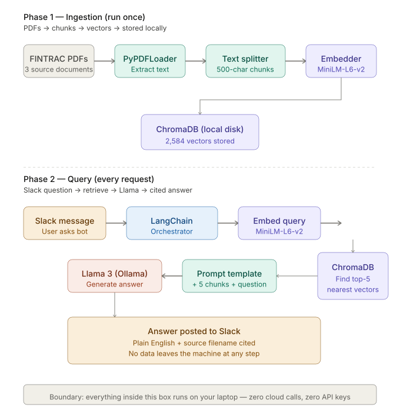
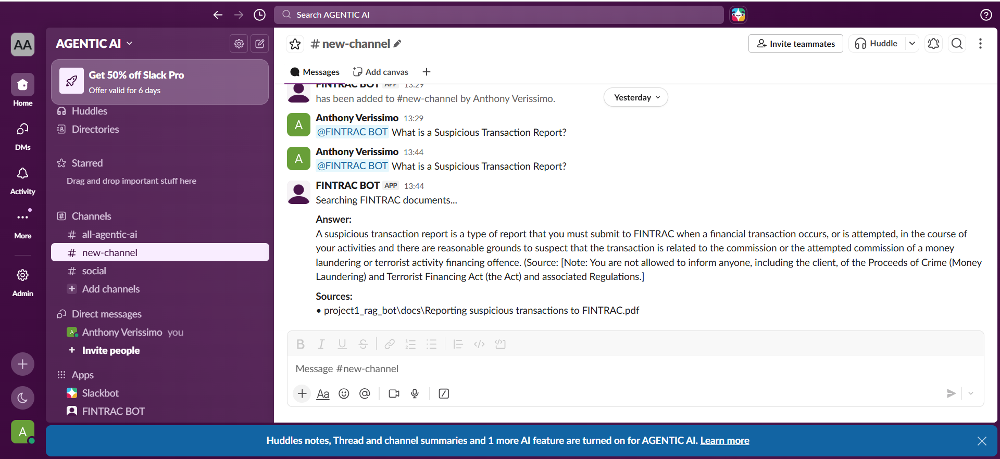

# FINTRAC Compliance AI Bot
**A secure, local RAG-based Q&A system for Canadian AML/ATF regulatory guidance.**

[](https://opensource.org/licenses/MIT)
[](https://www.python.org/)
[](https://ollama.com/)

---

## 📖 Overview
This bot allows compliance analysts to query Anti-Money Laundering (AML) and Anti-Terrorist Financing (ATF) rules. By using **Retrieval-Augmented Generation (RAG)**, the bot retrieves information directly from official FINTRAC documents, ensuring that every answer is grounded in source material and cited for auditability.


## 🛠️ Tech Stack
- **LLM Orchestration:** LangChain
- **Local LLM:** Llama 3 (via Ollama)
- **Vector Database:** ChromaDB
- **Embeddings:** HuggingFace (Local)
- **Interface:** Slack-Bolt (Python)
- **Data Source:** FINTRAC PDF Guidance

## 📐 Architecture & Workflow

### System Architecture


### User Workflow

*Analysts query rules via Slack and receive grounded, source-cited answers.*

---

## 🧠 Key Product & Engineering Decisions
Below are the strategic trade-offs made to ensure security and accuracy.

| Decision Area | Choice | Why This Choice | Trade-offs / Risks |
| :--- | :--- | :--- | :--- |
| **LLM Hosting** | Local Llama (Ollama) | Keeps sensitive AML workflows inside bank infrastructure. | Higher infra burden; weaker reasoning than GPT-4. |
| **Embeddings** | Local HuggingFace | Reduces privacy concerns and eliminates recurring API costs. | Lower retrieval quality than proprietary embeddings. |
| **Retrieval** | Strict Grounded RAG | Minimizes hallucinations and ensures regulatory auditability. | May refuse to answer ambiguous questions. |
| **Chunk Size** | ~500-token chunks | Balances precision with enough context for legal interpretation. | Risk of losing surrounding context in very long docs. |
| **Control** | "Don't know" fallback | Reduces risk of fabricated regulatory guidance. | Can frustrate users expecting a definitive answer. |
| **Scalability** | Prototype optimized for small team | Faster iteration and lower upfront cost. | May struggle with enterprise-wide concurrent usage. |
| **Fine-Tuning** | RAG over Fine-Tuning | Faster to ship and easier to update as regulations change. | Base model may lack deep domain nuance. |

---

## 🚀 Getting Started

### Prerequisites
- [Ollama](https://ollama.com/) installed and running.
- Python 3.10+

### Installation
1. Install Ollama and pull Llama 3:
   ```
   ollama pull llama3
   ```
 
2. Set up Python environment:
   ```
   python -m venv venv
   venv\Scripts\activate
   pip install -r requirements.txt
   ```
 
3. Add your FINTRAC PDFs to project1_rag_bot/docs/
 
4. Ingest documents:
   ```
   python project1_rag_bot/ingest.py
   ```

5. Run the bot:
   ```
   python project1_rag_bot/rag_chain.py
   ```
 
   Or run the Slack interface (requires .env with Slack tokens):
   ```
   python project1_rag_bot/slack_bot.py
   ```

---

## ✍️ Built By
**Anthony Verissimo**  
🔗 [LinkedIn](https://www.linkedin.com/in/tunjiv/)
📧 [tunjiverissimo@gmail.com](mailto:tunjiverissimo@gmail.com)


  
